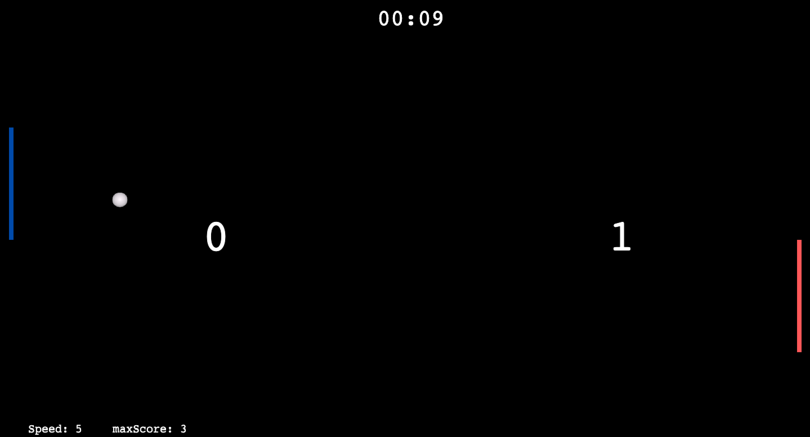

# Pong (made with Phaser3 JS)

Look for [demo](https://ping-pong-kappa.vercel.app/)


# 📄 Description

A platform project offering several useful tools for data science and data analysis.


## ℹ️ Overview

- The current version of the application only contains the architecture on which the tools will be added progressively.




## 🚀 Usage instructions

The version of Phaser used in this project is version **3.0**.

Install phaser using npm:

```
django-admin startproject {myproject}
```


## 💭 Feedback and contribution

> *If you found this project nice or if you have suggestions, please start a **Contribution** !*


### ✍️ Author

I am [Maxime Macé](https://github.com/MaximeMace), French computer engineer. I designed this game to practice on the PhaserJS library in a fun and playful way.


## 📖 Find me on

[LinkedIn](https://www.linkedin.com/in/maxime-mace-09694515b/)
